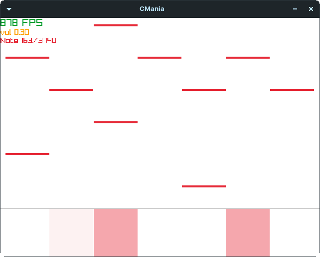

# Osu!mania clone


<p align="center">
    
</p>


Quick start (install raylib deps first)
```
python toolchain.py -cbr -a ./assets/80214\ Wotamin\ -\ Gigantic\ O.T.N/Wotamin\ -\ Gigantic\ O.T.N\ \(Star\ Stream\)\ \[L\ i\ a\'s\ Mania\].osu

```

- [`.osu` File format](https://osu.ppy.sh/wiki/en/Client/File_formats/Osu_(file_format))
- [Raylib docs](https://www.raylib.com/cheatsheet/cheatsheet.html)
- [Writing a Game Engine from Scratch - Part 1: Messaging](https://www.gamedeveloper.com/programming/writing-a-game-engine-from-scratch---part-1-messaging#close-modal)
- [Write Games, Not Engines](https://geometrian.com/programming/tutorials/write-games-not-engines/)
- [ScoreV1](https://osu.ppy.sh/wiki/en/Gameplay/Score/ScoreV1/osu%21mania)
- [Judgement](https://osu.ppy.sh/wiki/en/Gameplay/Judgement/osu%21mania)
- [Osu!lazer](https://github.com/ppy/osu)
- [osu-difficulty-calculator](https://github.com/ppy/osu-difficulty-calculator)
- [McOsu](https://github.com/McKay42/McOsu)

**Todo**
- [x] `.osu` parsing
- [ ] screens & main loop
- [ ] main menu screen
- [ ] gameplay screen
- [ ] scores screen
