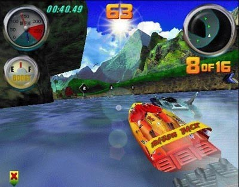
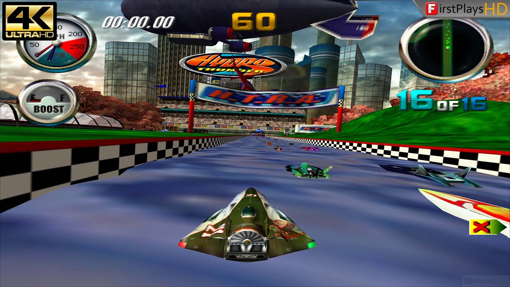
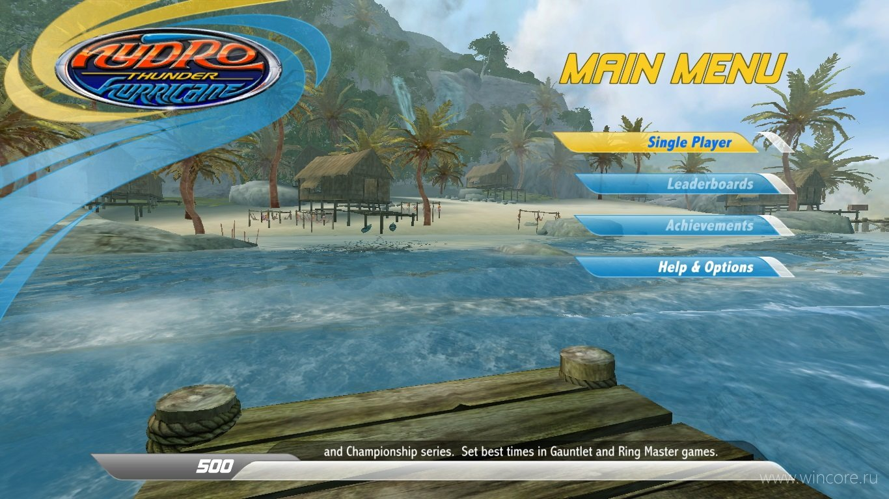
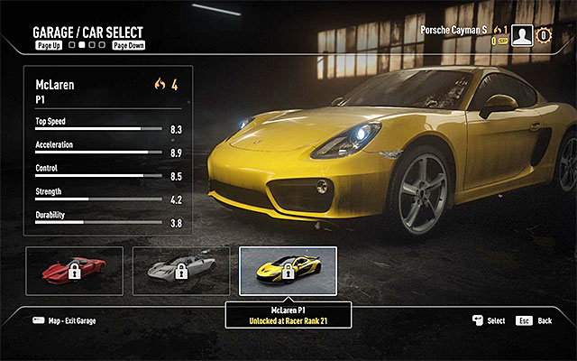
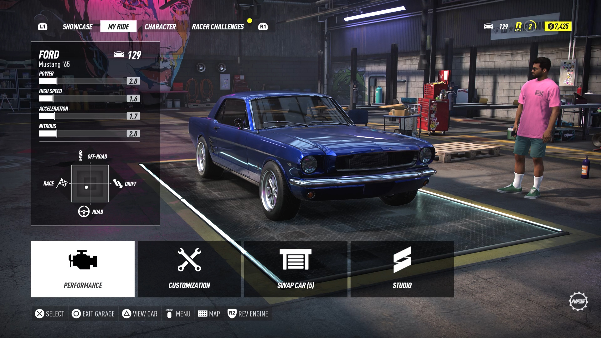
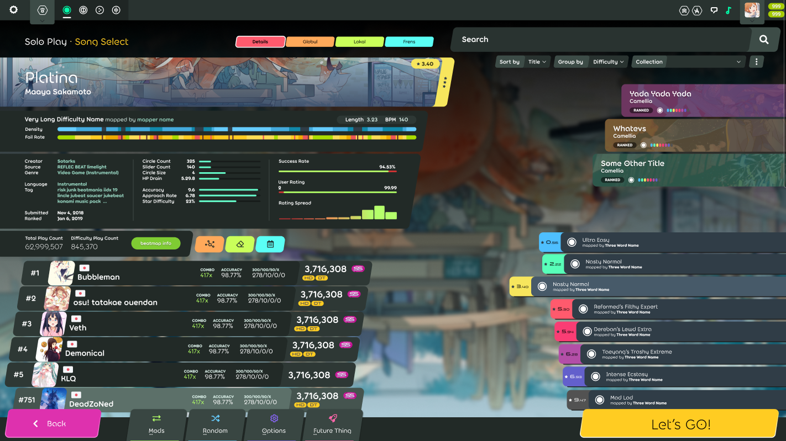

# Hydro Thunder clone

- [Raylib docs](https://www.raylib.com/cheatsheet/cheatsheet.html)
- [Writing a Game Engine from Scratch - Part 1: Messaging](https://www.gamedeveloper.com/programming/writing-a-game-engine-from-scratch---part-1-messaging#close-modal)
- [Write Games, Not Engines](https://geometrian.com/programming/tutorials/write-games-not-engines/)

## References

| Menu background would change depending on the map selected. |
| :----: |
|  |

| Track/boat select |
| :----: |
|  |
|  |
|  |
